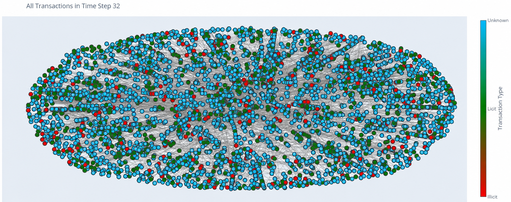
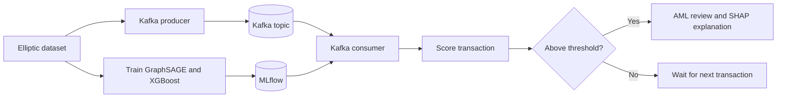
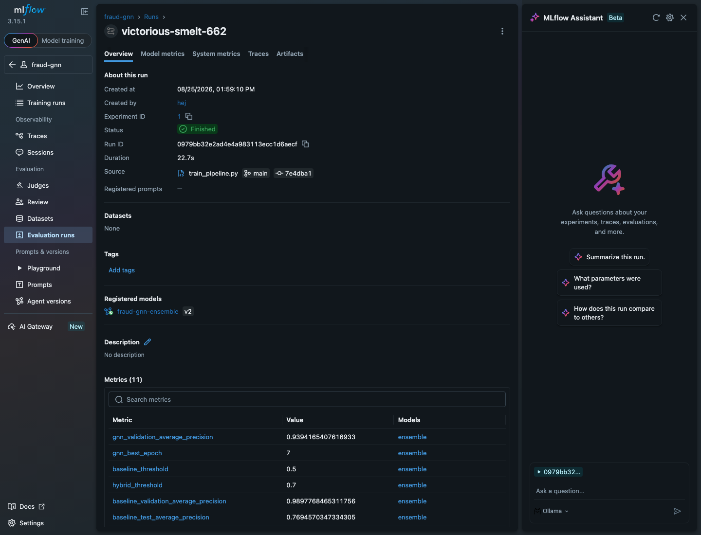
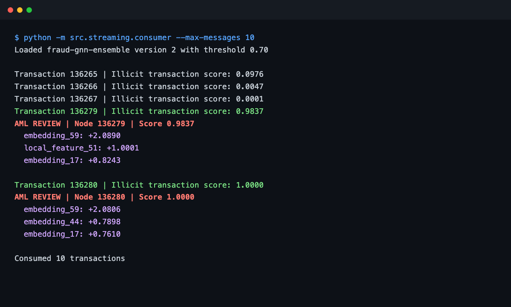

# Real-Time Fraud Detection with GraphSAGE

[](https://www.python.org/)
[](https://pytorch.org/)
[](https://pyg.org/)
[](https://xgboost.ai/)
[](https://kafka.apache.org/)
[](https://mlflow.org/)
[](https://www.docker.com/)

## Table of contents

- [About the project](#about-the-project)
- [Exploratory notebook](#exploratory-notebook)
- [Dataset](#dataset)
- [How it works](#how-it-works)
- [Architecture](#architecture)
- [Results](#results)
- [Screenshots](#screenshots)
- [Project structure](#project-structure)
- [How to run the project](#how-to-run-the-project)
- [Limitations](#limitations)

## About the project

This project is mainly a way for me to learn about fraud detection with graph-based methods, an area I was not familiar with before starting the project. I first train an XGBoost baseline using normal transaction features and then train GraphSAGE to learn information from the transaction graph.

The [exploratory notebook](src/data/exploratory.ipynb) is a good place to start. It shows how the ideas developed before they were moved into separate Python files.

The main experiment is whether concatenating GraphSAGE embeddings with the original transaction features improves the detection of illicit transactions. The final classifier is an XGBoost model trained on both types of features.

I also added a small Kafka service to practise working with event streams and simulate real-time scoring. For the same reason, I use MLflow to track training runs and package the GraphSAGE and XGBoost models as one model. The Kafka and MLflow setup is intentionally basic because the goal is to learn how the different parts work together.

This is a learning and portfolio project, not a production AML system.

## Exploratory notebook

The notebook covers the temporal split, baseline, GraphSAGE training, hybrid model and a small streaming example. Its outputs are already saved so it can be inspected without rerunning the full graph experiment.

```bash
jupyter notebook src/data/exploratory.ipynb
```

## Dataset

The project uses the [Elliptic Bitcoin Dataset](https://www.kaggle.com/datasets/ellipticco/elliptic-data-set), provided through PyTorch Geometric. Transactions are represented as nodes and payment flows as directed edges. The labels are licit, illicit or unknown.

The graph below shows the transactions from timestep 32. Unknown transactions are blue, licit transactions are green and illicit transactions are red.



Only the 93 transaction-local features are used. The 72 neighbour-aggregate features supplied with the dataset are excluded because those aggregates may not be available for a newly arriving transaction.

The data is split chronologically:

| Split | Timesteps |
| --- | --- |
| Training | 1–30 |
| Validation | 31–34 |
| Test | 35–49 |

Unknown labels are excluded from supervised training and evaluation. Graph snapshots also exclude future nodes and edges.

## How it works

1. XGBoost is trained as a baseline using the 93 local transaction features.
2. A two-layer GraphSAGE model samples 25 first-hop and 10 second-hop neighbours.
3. GraphSAGE produces a 64-dimensional embedding for each target transaction.
4. The 64 graph features and 93 local features are concatenated into 157 features.
5. A second XGBoost model is trained on the combined features.
6. The alert threshold is selected on validation F1 rather than chosen from the test set.
7. MLflow stores the GraphSAGE encoder, XGBoost model and threshold together.
8. Kafka sends test-period transactions to a consumer that rebuilds graph context and scores each transaction.

## Architecture



The Mermaid source is also available in [docs/architecture.mermaid](docs/architecture.mermaid).

## Results

The main question was whether adding GraphSAGE embeddings to the local features would improve Average Precision.

| Model | Validation AP | Test AP |
| --- | ---: | ---: |
| XGBoost baseline | 0.9898 | 0.7695 |
| GraphSAGE + XGBoost | 0.9865 | 0.7632 |

The GraphSAGE pre-training validation AP was 0.9394. The hybrid model selected a threshold of 0.70 on the validation set and produced the following test metrics:

| Precision | Recall | F1 |
| ---: | ---: | ---: |
| 0.8206 | 0.6759 | 0.7413 |

The hybrid model did not outperform the baseline in this run. Its test AP was slightly lower, so the experiment did not support my original hypothesis. This is still a useful result: the local Elliptic features were already strong and a basic GraphSAGE setup did not automatically add useful predictive information. I kept this result rather than presenting the hybrid model as an improvement.

These values come from one temporal split and one random seed, so they should not be treated as a general comparison between GraphSAGE and XGBoost.

## Screenshots

### MLflow training run

The training pipeline logs the model parameters, validation results, test results and packaged model to MLflow.



### Kafka consumer alerts

This example consumed ten transactions. Two scores exceeded the saved validation threshold and produced AML reviews with the three largest SHAP impacts.



## Project structure

```text
.
├── docker-compose.yml
├── requirements.txt
├── scripts/
│   └── evaluate_model.py
├── src/
│   ├── data/
│   │   ├── baseline_xgboost.py
│   │   ├── exploratory.ipynb
│   │   └── loader.py
│   ├── model/
│   │   ├── ensemble.py
│   │   └── graphsage.py
│   ├── streaming/
│   │   ├── consumer.py
│   │   └── producer.py
│   └── training/
│       ├── hybrid_train.py
│       ├── train_gnn.py
│       └── train_pipeline.py
└── docs/
    └── architecture.mermaid
```

## How to run the project

### Requirements

- Python 3.10
- Docker with Docker Compose
- Git

The project can run on CPU. Training and full evaluation may take several minutes depending on the machine.

### 1. Create the Python environment

```bash
git clone https://github.com/NeguseNegest/RealTime-Fraud-GNN.git
cd RealTime-Fraud-GNN
python3.10 -m venv .venv
source .venv/bin/activate
python -m pip install --upgrade pip
python -m pip install -r requirements.txt
```

The Elliptic dataset is downloaded automatically the first time the loader runs.

### 2. Start Kafka and MLflow

```bash
docker compose up -d
docker compose ps
```

The services are available at:

- MLflow UI: [http://127.0.0.1:5001](http://127.0.0.1:5001)
- Kafka: `127.0.0.1:9092`

### 3. Train and register the model

```bash
python -m src.training.train_pipeline
```

This trains GraphSAGE, extracts the embeddings, trains both XGBoost models and registers the packaged ensemble in MLflow. The default run uses 10 GraphSAGE epochs.

For a shorter test run:

```bash
python -m src.training.train_pipeline --epochs 2
```

### 4. Evaluate the saved model

```bash
python scripts/evaluate_model.py
```

This selects thresholds using the validation period and reports baseline and hybrid results on the untouched test period.

### 5. Run the real-time example

Open two terminals with the virtual environment active. Start the consumer first:

```bash
python -m src.streaming.consumer --group-id demo-consumer --max-messages 100
```

Then start the producer in the second terminal:

```bash
python -m src.streaming.producer --limit 100 --delay 0.01
```

The producer sends topologically ordered test transactions to the `aml-transactions` topic. The consumer loads the latest model from MLflow, updates its in-memory graph state and prints an AML review with three SHAP feature impacts when a score exceeds the saved threshold.

Use a new `--group-id` when repeating the demo if you want Kafka to read the topic from the beginning.

### 6. Stop the services

```bash
docker compose down
```

## Limitations

- The project uses one historical dataset, one temporal split and limited hyperparameter tuning.
- Kafka uses a single local broker and the consumer stores graph state in memory.
- The validation period covers only four timesteps.
- SHAP describes the final XGBoost inputs, including learned embedding dimensions that do not have simple real-world names.
- A real AML system would need persistent state, monitoring, security, governance and review by domain experts.

## License

This project is available under the [MIT License](LICENSE).
